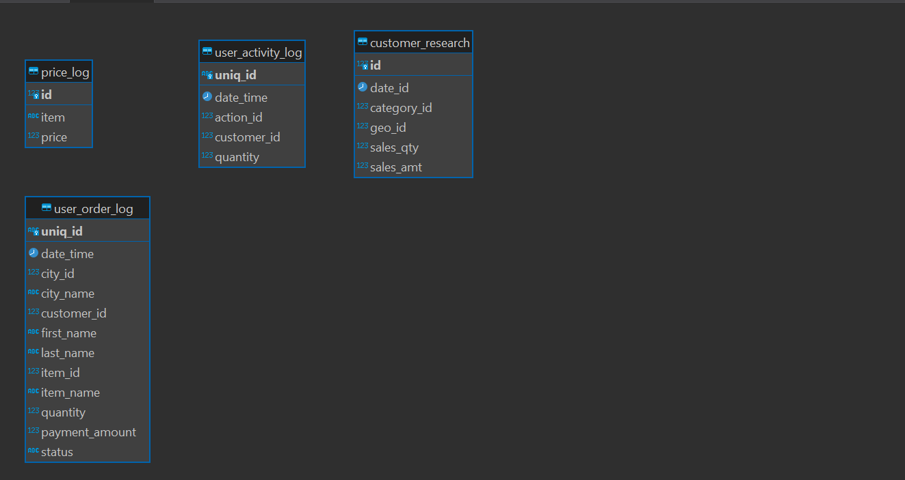
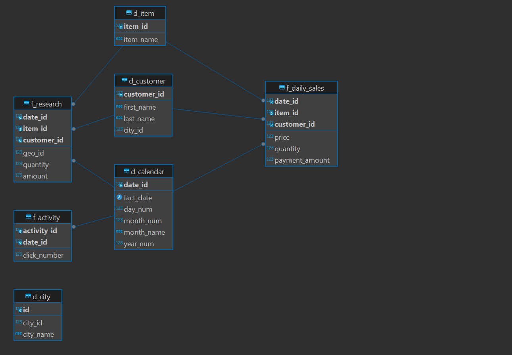

| Задачи                                                                                                                                                                                                                                                                                                                                                                                                                                                                                                          | Результаты                                                                                                                                                                                                                                                                                                                                                                                                                                                                        |
| :-------------------------------------------------------------------------------------------------------------------------------------------------------------------------------------------------------------------------------------------------------------------------------------------------------------------------------------------------------------------------------------------------------------------------------------------------------------------------------------------------------------------- | :------------------------------------------------------------------------------------------------------------------------------------------------------------------------------------------------------------------------------------------------------------------------------------------------------------------------------------------------------------------------------------------------------------------------------------------------------------------------------------------ |
| Модифицировать процессы в пайплайне, чтобы они соответствовали новым задачам бизнеса. Обеспечить обратную совместимость

 Создать обновленную витрину данных для исследования возвращаемости клиентов 

 Модифицировать ETL процесс, чтобы поддерживалась идемпотентность | Модифицировал процессы в пайплайне, чтобы они соответствовали новым задачам бизнеса, и обеспечивалась обратная совместимость

 Создал обновленную витрину данных для исследования возвращаемости клиентов 

 Добавил в ETL процесс поддержку идемпотентности |

# Модификация ETL и витрины. Реализация идемпотентности.

## **Используемые технологии**

AirFlow
SQL
PostgreSQL
psycopg2
pandas

## **Постановка задачи**

1. Команда разработки добавила в систему заказов магазина функционал отмены заказов и возврата средств (refunded). Требуется обновить процессы в пайплайне для учета нового функционала: использовать в витрине mart.f_sales статусы shipped и refunded. Все данные в витрине следует считать shipped.
2. Вычислить метрики customer retention в дополнительной витрине.
   Наполнить витрину.
   Эта витрина должна отражать следующую информацию:

* Рассматриваемый период — week.
* Возвращаемость клиентов:
  - new — количество клиентов, которые оформили один заказ за рассматриваемый период;
  - returning — количество клиентов, которые оформили более одного заказа за рассматриваемый период;
  - refunded — количество клиентов, которые вернули заказ за рассматриваемый период.
* Доход (revenue) и refunded для каждой категории покупателей.
  С помощью новой витрины можно будет выяснить, какие категории товаров лучше всего удерживают клиентов.

Требуемая схема витрины:

- new_customers_count — кол-во новых клиентов (тех, которые сделали только один
  заказ за рассматриваемый промежуток времени).
- returning_customers_count — кол-во вернувшихся клиентов (тех,
  которые сделали только несколько заказов за рассматриваемый промежуток времени).
- refunded_customer_count — кол-во клиентов, оформивших возврат за
  рассматриваемый промежуток времени.
- period_name — weekly.
- period_id — идентификатор периода (номер недели или номер месяца).
- item_id — идентификатор категории товара.
- new_customers_revenue — доход с новых клиентов.
- returning_customers_revenue — доход с вернувшихся клиентов.
- customers_refunded — количество возвратов клиентов.

3. Модифицировать процесс для соответствия идемпотентности. Перезапустить пайплайн и убедиться, что после перезапуска не появилось дубликатов в витринах mart.f_sales и mart.f_customer_retention.

Скрипты изменения и создания объектов БД, миграции данных в новую структуру в [migrations](migrations)

Обновленный скрипт с описанием DAG "upload_inc_data.py" в папке [src/dags](src/dags)

## staging

## dds

