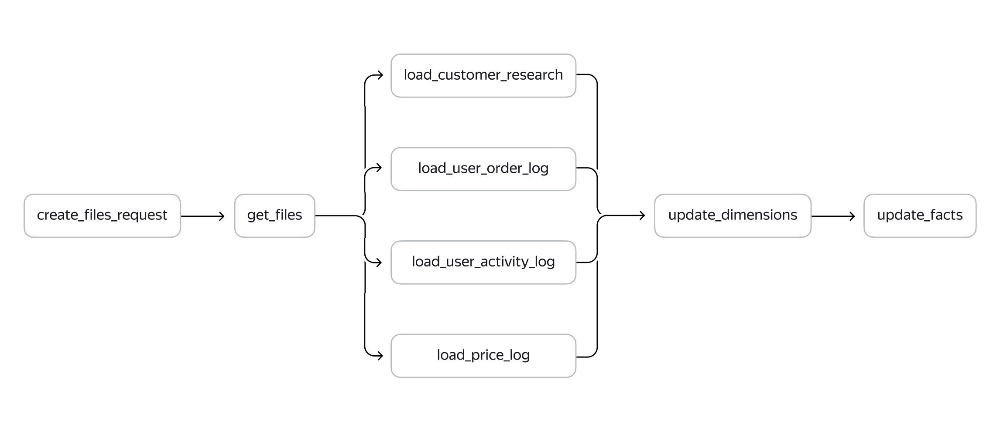
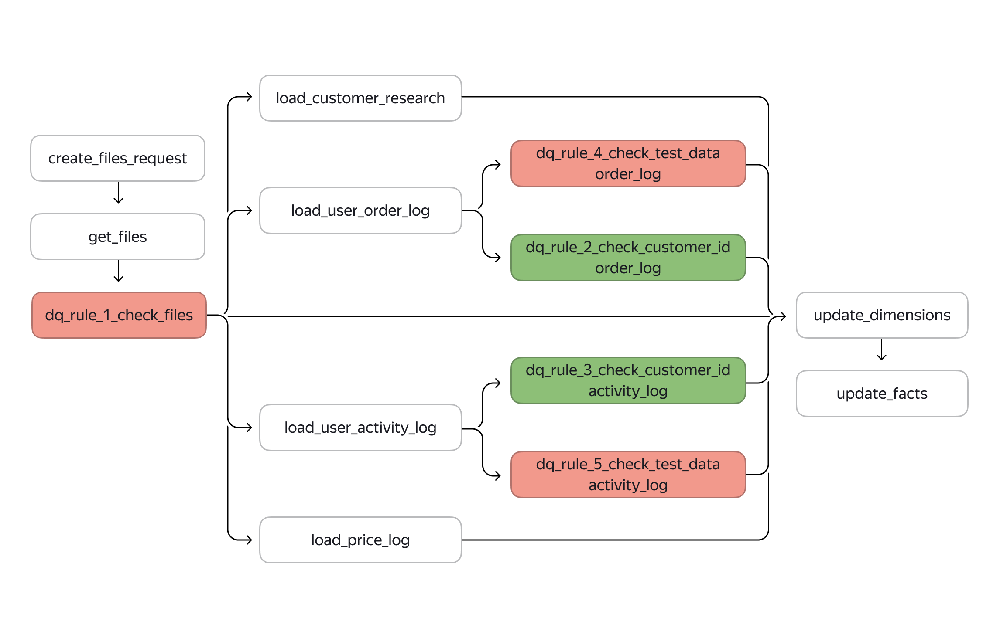

| Задачи                                                                                                                                                                                                                                                                                                                                                                                                                                     | Результаты |
| :----------------------------------------------------------------------------------------------------------------------------------------------------------------------------------------------------------------------------------------------------------------------------------------------------------------------------------------------------------------------------------------------------------------------------------------------- | :------------------- |
| Определить, на каких этапах ETL процесса внедрить проверки качества данных

 Разработать и внедрить проверки в ETL процесс 

 Создать витрину данных с результатами проверок 

 Составить инструкции по поддержке процессов с проверками |                      |

## **Цели проекта**

- Определить, на каких этапах ETL процесса внедрить проверки качества данных
- Разработать и внедрить проверки в ETL процесс
- Создать витрину данных с результатами проверок
- Составить инструкции по поддержке процессов с проверками

## **Используемые технологии и инструменты**

AirFlow
SQL
PostgreSQL
pandas

Лучшее место на схеме для первой проверки — после шага get_files, а для второй и третьей проверок — после шагов load_user_order_log и load_user_activity_log.

