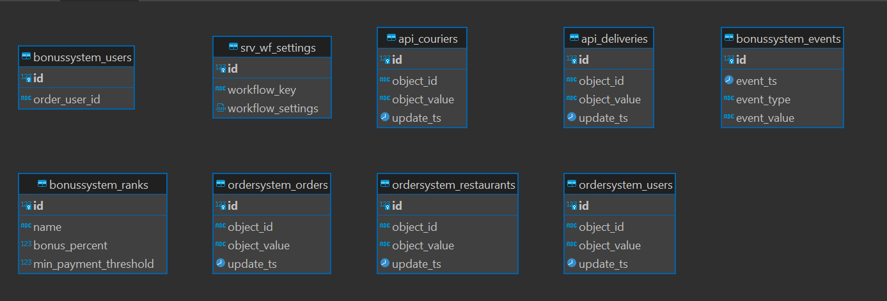
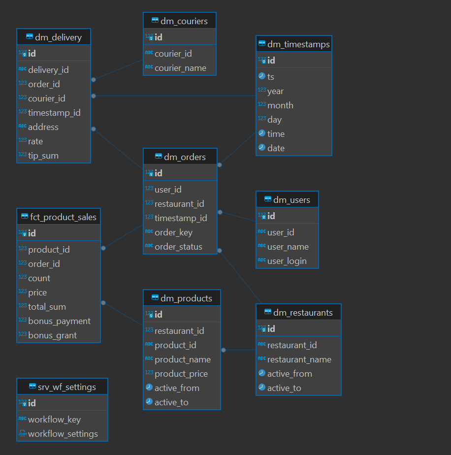
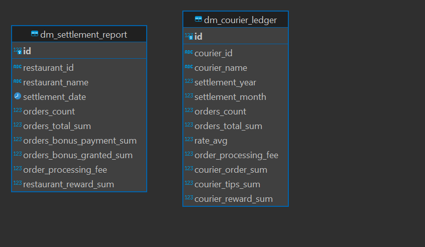

# Витрина на DWH из нескольких источников

**Цели проекта**

- Усовершенствовать хранилище данных: добавить новый источник и витрину.
- Связать данные из нового источника с данными в хранилище.
- Реализовать витрину для расчётов с курьерами.

## **Используемые технологии и инструменты**

AirFlow
PostgreSQL
MongoDB Compass
MongoConnect
pendulum
psycopg
PostgresHook

## **Постановка задачи**

Реализовать витрину для расчётов с курьерами. В ней требуется рассчитать суммы оплаты каждому курьеру за предыдущий месяц.  Расчётным числом является 10-е число каждого месяца. Из витрины бизнес будет брать нужные данные в готовом виде.
Отчёт собирается по дате заказа. Если заказ был сделан ночью и даты заказа и доставки не совпадают, в отчёте нужно ориентироваться на дату заказа, а не дату доставки.
Необходимо:
Изучить возможные источники и их внутреннюю модель хранения данных, а также технологии, которые используются для получения данных из этих источников.
На основе требований, целей дальнейшего использования, информации об источниках нужно спроектировать многослойную модель DWH.
Оформить необходимую документацию для передачи результатов заказчику.

Состав витрины:

* id —  идентификатор записи.
* courier\_id — ID курьера, которому перечисляем.
* courier\_name — Ф. И. О. курьера.
* settlement\_year  — год отчёта.
* settlement\_month  — месяц отчёта, где 1 — январь и 12 — декабрь.
* orders\_count  — количество заказов за период (месяц).
* orders\_total\_sum  — общая стоимость заказов.
* rate\_avg  — средний рейтинг курьера по оценкам пользователей.
* order\_processing\_fee  — сумма, удержанная компанией за обработку заказов, которая высчитывается      как orders\_total\_sum \* 0.25.
* courier\_order\_sum  — сумма, которую необходимо перечислить курьеру за доставленные им/ей      заказы. За каждый доставленный заказ курьер должен получить некоторую      сумму в зависимости от рейтинга (см. ниже).
* courier\_tips\_sum — сумма, которую пользователи оставили курьеру в качестве чаевых.
* courier\_reward\_sum  — сумма, которую необходимо перечислить курьеру. Вычисляется как courier\_order\_sum + courier\_tips\_sum \* 0.95 (5% — комиссия за обработку платежа).

Правила расчёта процента выплаты курьеру в зависимости от рейтинга, где r — это средний рейтинг курьера в расчётном месяце:

* r < 4 — 5% от заказа, но не менее 100 р.;
* 4 <= r < 4.5 — 7% от заказа, но не менее 150 р.;
* 4.5 <= r < 4.9 — 8% от заказа, но не менее 175 р.;
* 4.9 <= r — 10% от заказа, но не менее 200 р.

[inspect_api ](inspect_api.md)- изучение данных api

## Реализация

[connectors](src/dags/core/connectors) - коннекторы к 3 источникам (api, pg, mongo)

[domain](src/dags/core/domain) - основная логика загрузки данных в stg и dds

[dml_marts](src/dags/dml_marts) - заполнение витрин

## stg

## dds

## cdm

