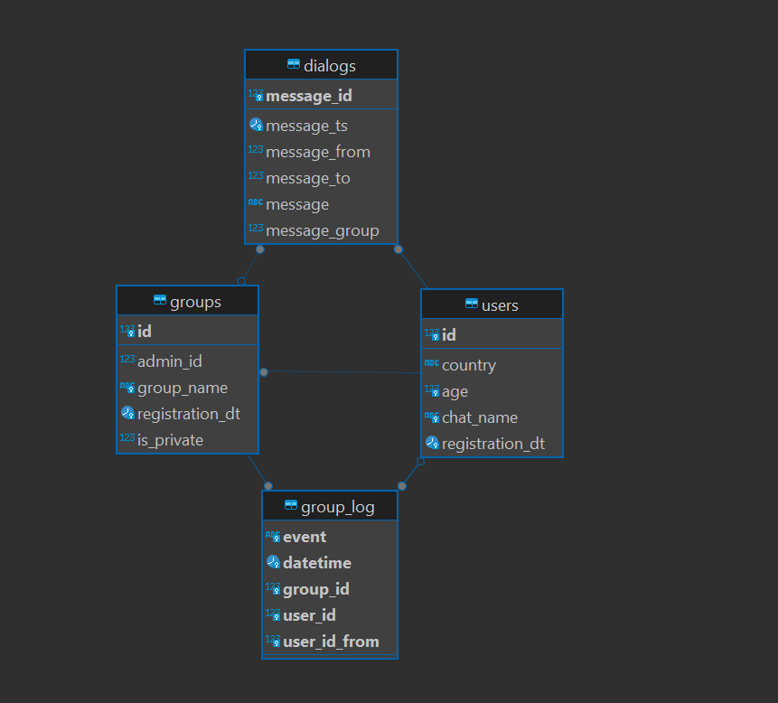
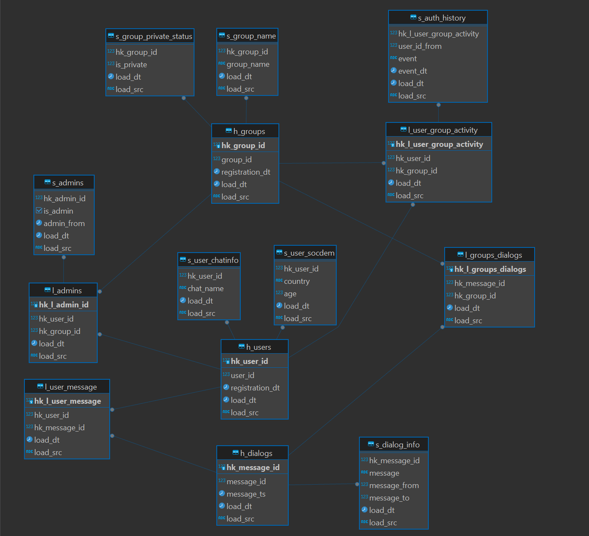

# Витрина на данных аналитической БД Vertica

| Задачи                                                                                                                                                                                           | Результаты |
| :----------------------------------------------------------------------------------------------------------------------------------------------------------------------------------------------------- | :------------------- |
| Расширить модель данных в аналитической БД

 Разработать витрину данных для оценки эффективности рекламы |                      |

## **Цели проекта**

- Расширить модель данных в аналитической БД
- Разработать витрину данных для оценки эффективности рекламы

## **Используемые технологии и инструменты**

AirFlow
Yandex S3 Storage
SQL
Vertica
boto3
vertica_python
pandas

## **Постановка задачи**

Маркетологи хотят разместить на сторонних сайтах рекламу сообществ с высокой активностью. Требуется определить группы, в которых начала общаться большая часть их участников, то есть с высокой конверсией в первое сообщение.

На схеме ниже видно, что в группе А конверсия выше, чем в Б. Хотя в группе А сейчас общается только 40 пользователей соцсети, а в Б — 50, доля активных в А выше, ведь в ней всего 50 человек. В то время как в группе Б сообщения написали уже 50 участников, но это лишь половина от общего количества — 100. Значит, если в обе группы вступит одинаковое число людей, эффективнее сработает сообщество А, потому что оно лучше вовлекает своих участников. Получается, что для рекламы соцсети стоит выбрать группу А и другие паблики с высокой конверсией.

Требуется выявить и перечислить маркетологам такие сообщества.

Декомпозиция задачи:

1. Перенести из S3 в staging-слой новые данные о входе и выходе пользователей из групп — файл group_log.csv.
   Лог работы групп group_log.csv содержит:
   group_id — уникальный идентификатор группы
   user_id — уникальный идентификатор пользователя
   user_id_from — поле для отметки о том, что пользователь не сам вступил в группу, а его добавил другой участник. Если пользователя пригласил в группу кто-то другой, поле будет непустым.
   event — действие, которое совершено пользователем user_id. Возможны следующие варианты:
   create — пользователь создал группу
   add — пользователь user_id вступил сам или был добавлен в группу
   leave — пользователь user_id покинул группу
   datetime — время совершения event
2. Создать в слое постоянного хранения таблицы для новых данных.
3. Перенести новые данные из staging-области в слой DDS.
4. Рассчитать конверсионные показатели для десяти самых старых групп:

- количество пользователей, вступивших в группу, — cnt_added_users;
- количество участников группы, которые написали хотя бы одно сообщение, — cnt_users_in_group_with_messages;
- конверсию в первое сообщение из вступления в группу — group_conversion.

## stg

## dds

