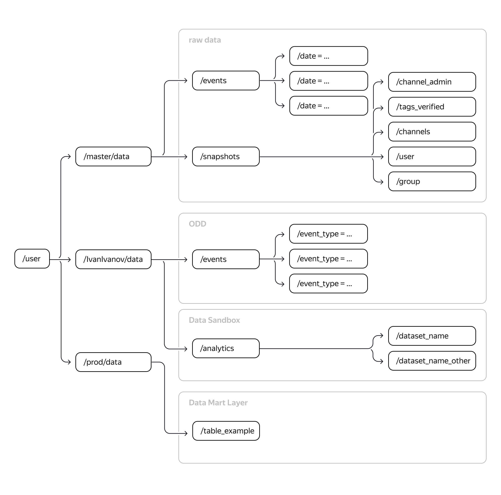

# Spark/PySpark. Работа с HDFS.


| Задачи                                                                                                                                                                                      | Результаты |
| :------------------------------------------------------------------------------------------------------------------------------------------------------------------------------------------------ | :------------------- |
| Расширить структуру данных в Data Lake<P><P> Создать четыре витрины данных в HDFS, автоматизировать их обновление |                      |

## **Цели проекта**

- Расширить структуру данных в Data Lake
- Создать четыре витрины данных в HDFS, автоматизировать их обновление

## **Используемые технологии и инструменты**

PySpark
SQL
HDFS
Airflow
Jupyter Notebook

## **Схема слоев Data Lake**



* ## **Слой сырых данных — Raw**

Сырые данные пойдут в отдельный слой: `[/user]/master/data/events/date=YYYY-MM-dd/part0000.json`. В нём лежат таблица событий с одной директорией и пять снапшотов — под них отведено 10 директорий. А после предобработки они в соответствии с требованиями распределятся по сущностям: тип события и дата.

* ## **Слой предобработанных данных — ODS**

Обработанные данные, партиционированные по типу событий и по дате `[/user]/prod/data/events/event_type=XXX/date=yyyy-MM-dd/part0000.parquet`.

Так как не поменялась структура самих данных, а изменились только уровни хранения — добавлено партиционирование по типу событий — то этот слой нельзя назвать слоем детальных данных. Это слой ODS, операционный слой данных. В нём лежит таблица событий — одна директория.

* ## **Слой песочницы — Data Sandbox**

Песочница предназначена для данных аналитики — тоже в одной директории. Слой нужен для построения аналитики и решения ad hoc задач.

## Данные

### **Events raw**

* *event_type: "subscription"*

```
{"event":{"datetime":"2022-05-31 03:35:36","subscription_channel":302890,"user":"76363"},"event_type":"subscription"}
```

* *event_type: "message"*

```
{"event":{"message":"anyone how to make xchat stop beeping everytime i type lol","message_from":128565,"message_group":225,"message_id":439392,"message_to":149488,"message_ts":"2021-06-21 03:32:35.000000000"},"event_type":"message","lat":-16.83483617853229,"lon":146.36631113463545}
```

* *event_type: "reaction"*

```
{"event":{"datetime":"2022-05-30 15:50:48","message_id":1100924,"reaction_from":"64223","reaction_type":"like"},"event_type":"reaction"}
```

### Координаты городов Австралии

* [geo](geo.csv)

## Описание задачи

Коллеги из другого проекта по просьбе вашей команды начали вычислять координаты событий (сообщений, подписок, реакций, регистраций), которые совершили пользователи соцсети. Значения координат будут появляться в таблице событий. Пока определяется геопозиция только исходящих сообщений, но уже сейчас можно начать разрабатывать новый функционал.

В продукт планируют внедрить систему рекомендации друзей. Приложение будет предлагать пользователю написать человеку, если пользователь и адресат:

* состоят в одном канале,
* раньше никогда не переписывались,
* находятся не дальше 1 км друг от друга.

При этом команда хочет лучше изучить аудиторию соцсети, чтобы в будущем запустить монетизацию. Для этого было решено провести геоаналитику:

* Выяснить, где находится большинство пользователей по количеству сообщений, лайков и подписок из одной точки.
* Посмотреть, в какой точке Австралии регистрируется больше всего новых пользователей.
* Определить, как часто пользователи путешествуют и какие города выбирают.

Благодаря такой аналитике в соцсеть можно будет вставить рекламу: приложение сможет учитывать местонахождение пользователя и предлагать тому подходящие услуги компаний-партнёров.

## Реализация

#### **Построил витрину в разрезе пользователей - UserGeoMart**

* user\_id — идентификатор пользователя.
* act\_city — актуальный адрес. Это город, из которого было отправлено последнее сообщение.
* home\_city — домашний адрес. Это последний город, в котором пользователь был дольше 27 дней.
* travel\_count  — количество посещённых городов. Если пользователь побывал в каком-то      городе повторно, то это считается за отдельное посещение.
* travel\_array  — список городов в порядке посещения
* TIME\_UTC  — время в таблице событий. Указано в UTC+0.
* timezone  — актуальный адрес. Атрибуты содержатся в виде Australia/Sydney.

#### **Построил витрину в разрезе зон - ZoneGeoMart**

* month — месяц расчёта;
* week  — неделя расчёта;
* zone\_id  — идентификатор зоны (города);
* week\_message  — количество сообщений за неделю;
* week\_reaction  — количество реакций за неделю;
* week\_subscription  — количество подписок за неделю;
* week\_user  — количество регистраций за неделю;
* month\_message  — количество сообщений за месяц;
* month\_reaction   — количество реакций за месяц;
* month\_subscription  — количество подписок за месяц;
* month\_user  — количество регистраций за месяц.

#### **Построил витрину для рекомендации друзей - FriendRecommendationMart**

* user\_left — первый пользователь;
* user\_right  — второй пользователь;
* processed\_dttm — дата расчёта витрины;
* zone\_id  — идентификатор зоны (города);
* local\_time  — локальное время.
