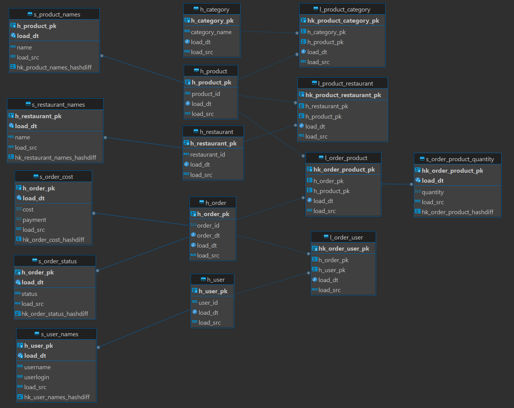
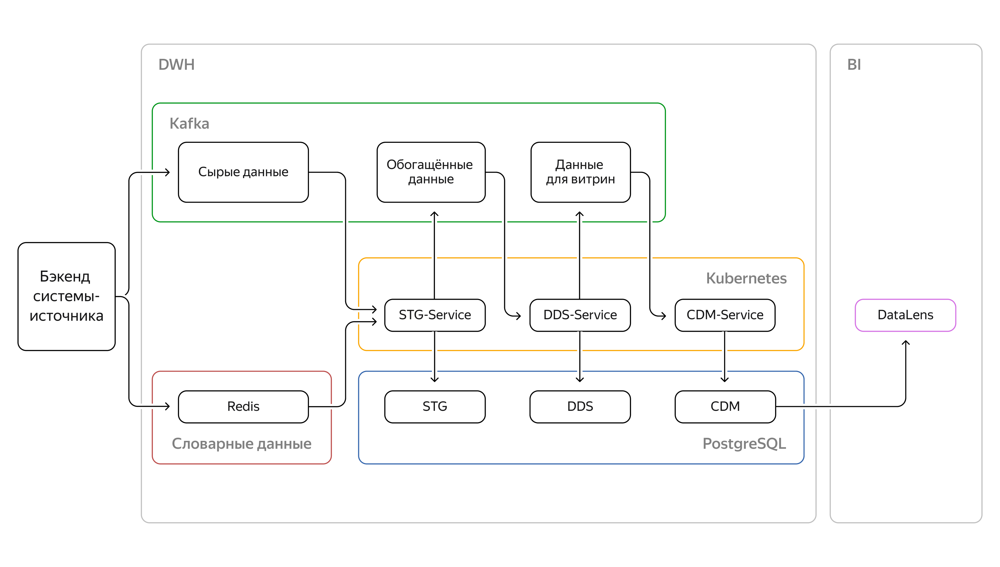

# Создание сервисов в инфраструктуре Yandex Cloud

## **Цели проекта**

- Создать на платформе Yandex Cloud три сервиса, которые реализуют ETL процесс
- Визуализировать данные из новой витрины в дашборде в Datalense

## **Используемые технологии и инструменты**

Yandex Cloud Services
Kubernetes
kubectl
Kafka
kcat
confluent_kafka
flask
Docker Compose
Helm
Redis

## Требования к dwh

Бизнес-задача — «тегирование гостей». Однако при проектировании и реализации нужно помнить, что строится хранилище данных, которое потом будет активно расширяться и развиваться.

С функциональной точки зрения структура хранилища стандартная: слои STG, DDS, CDM.

Особенности слоёв:

* В STG — исходные данные as is.
* В CDM — две витрины. Первая витрина — счётчик заказов по блюдам; вторая — счётчик заказов по категориям товаров.
* В DDS — модель данных Data Vault.

Данные из системы-источника передаются по двум каналам:

* Первый канал — это поток заказов, который идёт в Kafka (5 заказов в минуту).
* Второй канал — это словарные данные (блюда, рестораны, пользователи), которые идут в Redis.

В качестве БД используется PostgreSQL. Логику обработки данных нужно написать на Python, она будет разворачиваться в Kubernetes. Брокер сообщений как на вход, так и для обмена данными между сервисами — Kafka.

## Модели данных в PostgreSQL

### STG


### DDS



### CDM


## Архитектура решения

Kafka, Redis, PostgreSQL, Container Registry - подняты самостоятельно в Yandex Cloud



#### Собираю образы:

docker build . -t cr.yandex/crp4qpf7vo23o1baldqa/stg_service:v2023-10-1-r1.
docker build . -t cr.yandex/crp4qpf7vo23o1baldqa/dds_service:v2023-10-11-r1.
docker build . -t cr.yandex/crp4qpf7vo23o1baldqa/cdm_service:v2023-10-9-r1.

#### Заливаю в облако:

docker push cr.yandex/crp4qpf7vo23o1baldqa/stg_service:v2023-10-1-r1
docker push cr.yandex/crp4qpf7vo23o1baldqa/dds_service:v2023-10-11-r1
docker push cr.yandex/crp4qpf7vo23o1baldqa/cdm_service:v2023-10-9-r1

#### Заливаю образы в Kubernetes с помощью helm:

\~/helm/helm uninstall de-project-stg
\~/helm/helm upgrade --install --atomic de-project9-stg ../app_stg
\~/helm/helm uninstall de-project-dds
\~/helm/helm upgrade --install --atomic de-project9-dds ../app\_dds
\~/helm/helm uninstall de-project-cdm
\~/helm/helm upgrade --install --atomic de-project9-cdm ../app\_cdm

#### Смотрю логи работы в Kubernetes

kubectl get pods
kubectl logs -f [имя пода]

## Данные

* В Redis лежат два вида объектов — рестораны и пользователи

Рестораны:

```
{
  "_id": "a51e4e31ae4602047ec52534",
  "name": "Кубдари",
  "menu": [
    {
      "_id": "3de9442da57a50ccfaf72866",
      "name": "Пхали с фасолью",
      "price": 200,
      "category": "Закуски"
    },
    {
      "_id": "c1b046c8b2184d586ea74928",
      "name": "Ассорти пхали",
      "price": 290,
      "category": "Закуски"
    },
    {
      "_id": "d9e3403e806ad914f08ab416",
      "name": "Долма",
      "price": 400,
      "category": "Закуски"
    },
    {
      "_id": "6f8c430e9883b87eb3849dc0",
      "name": "Бадриджани с орехами",
      "price": 400,
      "category": "Закуски"
    },
    {
      "_id": "c5b64c8ba71adb08ce4bf7bc",
      "name": "Аджапсандали",
      "price": 400,
      "category": "Закуски"
    },
    {
      "_id": "165b4812b4334fdbeaeca3a3",
      "name": "Лобио",
      "price": 350,
      "category": "Закуски"
    },
    {
      "_id": "4a8b4c698fc9d21622d9ff25",
      "name": "Сациви из курицы",
      "price": 350,
      "category": "Закуски"
    },
    {
      "_id": "3dc44b0684e19baecc9d19e1",
      "name": "Пхали со шпинатом",
      "price": 200,
      "category": "Закуски"
    },
    {
      "_id": "844c4628a01217273b8ac0d7",
      "name": "Пхали со свеклой",
      "price": 200,
      "category": "Закуски"
    },
    {
      "_id": "a56c4b70b7d0e6522ccb3c9f",
      "name": "Салат Греческий",
      "price": 350,
      "category": "Салаты"
    },
    {
      "_id": "96ca4cf8b0217ce521be2389",
      "name": "Салат Тбилисо",
      "price": 450,
      "category": "Салаты"
    },
    {
      "_id": "dac24794ac36b29e09e8caf0",
      "name": "Салаи со сладкими помидорами",
      "price": 350,
      "category": "Салаты"
    },
    {
      "_id": "41ff432396c5c7c414e5a4a9",
      "name": "Сала по-грузински с орехом",
      "price": 350,
      "category": "Салаты"
    },
    {
      "_id": "bf65470ca47ae56177951569",
      "name": "Кубдари с говядиной с свининой",
      "price": 450,
      "category": "Выпечка"
    },
    {
      "_id": "e4a889192c3aa97ec1",
      "name": "Хачапури со шпинатом и сыром",
      "price": 450,
      "category": "Выпечка"
    },
    {
      "_id": "30fc434da23b451a314c323f",
      "name": "Хачапури по-аджарски с томатами",
      "price": 430,
      "category": "Выпечка"
    },
    {
      "_id": "79594852878ed8bb3e093a57",
      "name": "Хачапури по-мегрельски",
      "price": 390,
      "category": "Выпечка"
    },
    {
      "_id": "6af740d0b2b49d74de0bec85",
      "name": "Хачапури по-аджарски",
      "price": 390,
      "category": "Выпечка"
    },
    {
      "_id": "1acb452ebcc8c462953a121d",
      "name": "Хачапури с картофелем и грибами",
      "price": 350,
      "category": "Выпечка"
    },
    {
      "_id": "60fd41ab8c8f919e7ee17634",
      "name": "Хачапури по-имеретински",
      "price": 390,
      "category": "Выпечка"
    },
    {
      "_id": "c92f41deb2e95a4187aad796",
      "name": "Грузинский хлеб шоти",
      "price": 50,
      "category": "Выпечка"
    },
    {
      "_id": "a46c44c7a2116150664eec02",
      "name": "Мини кубдари с курицей и сыром",
      "price": 250,
      "category": "Выпечка"
    },
    {
      "_id": "1b3e42939c414bc1ea69e2fe",
      "name": "Мини кубдари с говядиной и свининой",
      "price": 250,
      "category": "Выпечка"
    },
    {
      "_id": "60b4455ead3234b9575b8b66",
      "name": "Лимонад грузинский",
      "price": 190,
      "category": "Напитки"
    },
    {
      "_id": "41cd40de86c2728eb72b819d",
      "name": "Вода Свирме",
      "price": 190,
      "category": "Напитки"
    },
    {
      "_id": "2d614774b2d57fd0650a3129",
      "name": "Соус Сметана",
      "price": 50,
      "category": "Соусы"
    },
    {
      "_id": "28d949a99671154acd0d0160",
      "name": "Соус Сметана с чесноком",
      "price": 50,
      "category": "Соусы"
    },
    {
      "_id": "48ae4b6791696398de59d8f7",
      "name": "Соус Сацибели",
      "price": 50,
      "category": "Соусы"
    },
    {
      "_id": "c97b4da89832c190235d5961",
      "name": "Соус Аджика",
      "price": 50,
      "category": "Соусы"
    },
    {
      "_id": "45c34a7eaea04e757faee967",
      "name": "Соус Наршараб",
      "price": 100,
      "category": "Соусы"
    },
    {
      "_id": "24094fbba9e3187d52e0af77",
      "name": "Соус Ткемали",
      "price": 50,
      "category": "Соусы"
    }
  ],
  "update_ts_utc": "2024-09-23 13:20:11"
}
```

Пользователи:

```
{
   "_id": "626a81ce9a8cd1920641e264",
   "name": "Гаврила Архипович Игнатьев",
   "login": "gavaii_2222",
   "update_ts_utc": "2024-09-23 13:19:33"
}
```

* В kafka данные по заказам

```
{"object_id": 5501069, 
"object_type": "order", 
"sent_dttm": "2023-09-25 11:55:23", 
"payload": {
    "restaurant": {"id": "ebfa4c9b8dadfc1da37ab58d"}, 
    "date": "2023-09-18 12:13:09", 
    "user": {"id": "626a81ce9a8cd1920641e272"}, 
    "order_items": [{"id": "88b343b9b0fd8832deef4760", 
                    "name": "\u041a\u0430\u0437\u0430\u043d \u043a\u0435\u0431\u0430\u0431 \u0441 \u0433\u043e\u0432\u044f\u0434\u0438\u043d\u043e\u0439", 
                    "price": 500, 
                    "quantity": 1}, 
                    {"id": "e0f74cc69658b5b3fd721a6e", 
                    "name": "\u041a\u0430\u0437\u0430\u043d \u043a\u0435\u0431\u0430\u0431 \u0441 \u0431\u0430\u0440\u0430\u043d\u0438\u043d\u043e\u0439", 
                    "price": 520, 
                    "quantity": 5}, 
                    {"id": "b92d4d66bc844b7fd7ade634", 
                    "name": "\u041f\u043b\u043e\u0432 \u0447\u0430\u0439\u0445\u0430\u043d\u0441\u043a\u0438\u0439", 
                    "price": 420, 
                    "quantity": 3}, 
                    {"id": "73b5464c81753e4e17adec88", 
                    "name": "\u0421\u0443\u043f \u043a\u0443\u0440\u0438\u043d\u044b\u0439", 
                    "price": 300, 
                    "quantity": 1}, 
                    {"id": "09d643efb06f112548c2514e", 
                    "name": "\u041c\u0430\u043d\u0442\u044b \u0441 \u0431\u0430\u0440\u0430\u043d\u0438\u043d\u043e\u0439 3\u0448\u0442", 
                    "price": 250, 
                    "quantity": 4}], 
    "bonus_payment": 0, 
    "cost": 5660, 
    "payment": 5660, 
    "bonus_grant": 0, 
    "statuses": [{"status": "CLOSED", "dttm": "2023-09-18 12:13:09"},
                 {"status": "DELIVERING", "dttm": "2023-09-18 11:31:07"}, 
                 {"status": "COOKING", "dttm": "2023-09-18 11:20:44"}, 
                 {"status": "OPEN", "dttm": "2023-09-18 11:15:21"}], 
    "final_status": "CLOSED", 
    "update_ts": "2023-09-18 12:13:09"}}
```
