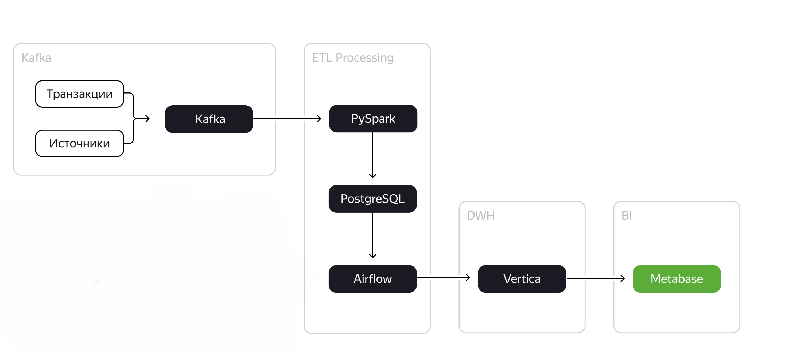
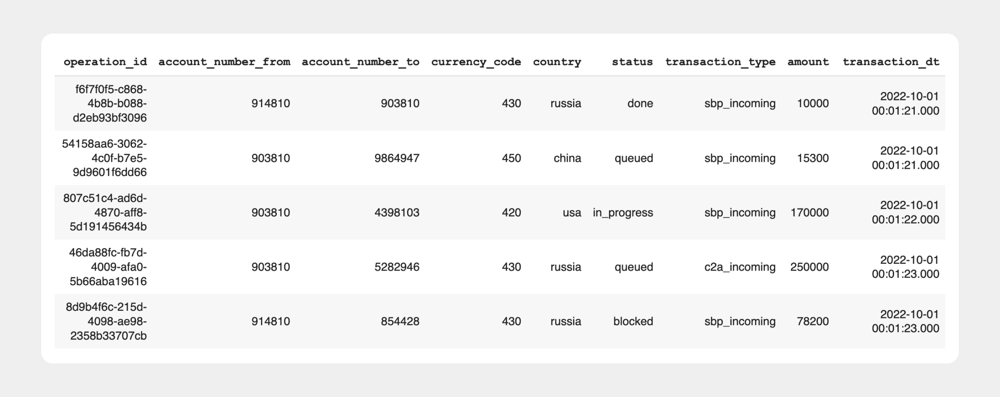
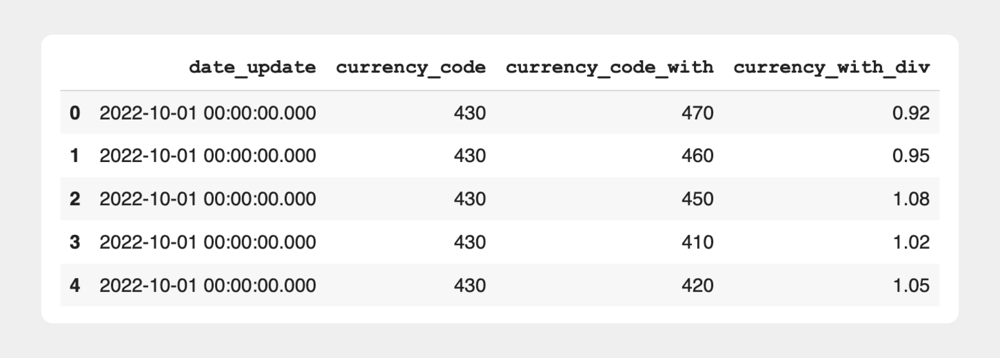

# Объединение потоков данных. Разработка витрины для аналитики.

| Задачи                                                                                                                                                                                                                        | Результаты |
| :---------------------------------------------------------------------------------------------------------------------------------------------------------------------------------------------------------------------------------- | :------------------- |
| Реализовать пайплайн обработки данных из нескольких источников для финтех-стартапа. Разработать витрину для аналитики |                      |

## **Используемые технологии и инструменты**

Kafka

AirFlow

Vertica

Spark Streaming

PostgreSQL

Metabase

Docker

## План проекта

### **Пайплайн загрузки данных из систем-источников в staging-слой**

* Реализован пайплайн для ежедневной выгрузки данных из Kafka и загрузки в staging-слой хранилища в Vertica - [Spark-задача](src/kafka_pg/kafka_pg_loader.py), [origin_vertica_stg_dag](src/origin_vertica_stg_dag.py)

### Пайплайн обновления витрины данных

* Реализован пайплайн обновления витрины данных [dwh_vertica_global_metrics_dag](src/dwh_vertica_global_metrics_dag.py) - запускается по триггеру из [origin_vertica_stg_dag](src/origin_vertica_stg_dag.py)

### Создана витрина `global_metrics` с агрегацией по дням.

Витрина помогает отвечать на такие вопросы:

* какая ежедневная динамика сумм переводов в разных валютах;
* какое среднее количество транзакций на пользователя;
* какое количество уникальных пользователей совершают транзакции в валютах;
* какой общий оборот компании в единой валюте.
  Поля витрины:
  * `date_update` — дата расчёта,
  * `currency_from` — код валюты транзакции;
  * `amount_total` — общая сумма транзакций по валюте в долларах;
  * `cnt_transactions` — общий объём транзакций по валюте;
  * `avg_transactions_per_account` — средний объём транзакций с аккаунта;
  * `cnt_accounts_make_transactions` — количество уникальных аккаунтов с совершёнными транзакциями по валюте.

Витрина обновляется ежедневно инкрементом на основании данных из таблиц [transactions ](src/sql/ddl_vertica_tables.sql)и [currencies](src/sql/ddl_vertica_tables.sql). Каждый день добавляеться новая запись за вчера.

## Входные данные

Данные **transactions** содержат в себе информацию о движении денежных средств между клиентами в разных валютах.

Структура данных:

* operation\_id  — id транзакции;
* account\_number\_from — внутренний бухгалтерский номер счёта транзакции ОТ КОГО;
* account\_number\_to — внутренний бухгалтерский номер счёта транзакции К КОМУ;
* currency\_code — трёхзначный код валюты страны, из которой идёт транзакция;
* country — страна-источник транзакции;
* status — статус проведения транзакции: queued («транзакция в очереди на обработку сервисом»), in\_progress («транзакция в обработке»), blocked («транзакция  заблокирована сервисом»), done («транзакция выполнена успешно»), chargeback («пользователь осуществил возврат по транзакции»).
* transaction\_type — тип транзакции во внутреннем учёте: authorisation («авторизационная  транзакция, подтверждающая наличие счёта пользователя»), sbp\_incoming («входящий перевод по системе быстрых платежей»), sbp\_outgoing («исходящий  перевод по системе быстрых платежей»), transfer\_incoming («входящий  перевод по счёту»), transfer\_outgoing («исходящий перевод по счёту»), c2b\_partner\_incoming («перевод от юридического лица»), c2b\_partner\_outgoing («перевод  юридическому лицу»).
* amount  — целочисленная сумма транзакции в минимальной единице валюты страны      (копейка, цент, куруш);
* transaction\_dt  — дата и время исполнения транзакции до миллисекунд.

Данные сurrencies — это справочник, который содержит в себе информацию об обновлениях курсов валют и взаимоотношениях валютных пар друг с другом.

Структура данных:

* date\_update  — дата обновления курса валют;
* currency\_code — трёхзначный код валюты транзакции;
* currency\_code\_with — отношение другой валюты к валюте трёхзначного кода;
* currency\_code\_div  — значение отношения единицы одной валюты к единице валюты транзакции.

